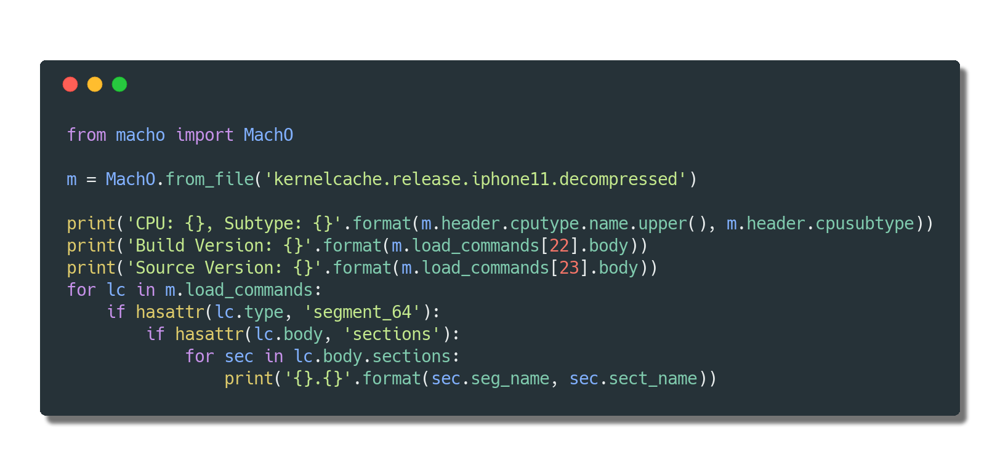

# docker-kaitai

[](https://circleci.com/gh/blacktop/docker-kaitai) [](http://doge.mit-license.org) [](https://hub.docker.com/r/blacktop/kaitai/) [](https://hub.docker.com/r/blacktop/kaitai/) [](https://hub.docker.com/r/blacktop/kaitai/)

> [Kaitai Struct](https://kaitai.io) Docker Image

---

## Dependencies

- [openjdk:jre-slim](https://hub.docker.com/_/openjdk/)

## Image Tags

```bash
REPOSITORY               TAG                 SIZE
blacktop/kaitai          latest              357MB
blacktop/kaitai          0.8                 357MB
```

## Getting Started

```bash
docker run --rm -v `pwd`:/output blacktop/kaitai:0.8 -t python executable/mach_o.ksy --outdir /output
```

Now you can use the output in python

<a href="#"></a>

```bash
CPU: ARM64, subtype: 2
```

### Start WebIDE

```bash
docker run -d -p 8000:8000 -w /kaitai/webide --entrypoint python blacktop/kaitai:0.8 -mSimpleHTTPServer
```

Navigate to [http://127.0.0.1:8000](http://127.0.0.1:8000/)


## Issues

Find a bug? Want more features? Find something missing in the documentation? Let me know! Please don't hesitate to [file an issue](https://github.com/blacktop/docker-kaitai/issues/new)

## CHANGELOG

See [`CHANGELOG.md`](https://github.com/blacktop/docker-kaitai/blob/master/CHANGELOG.md)

## Contributing

[See all contributors on GitHub](https://github.com/blacktop/docker-kaitai/graphs/contributors).

Please update the [CHANGELOG.md](https://github.com/blacktop/docker-kaitai/blob/master/CHANGELOG.md) and submit a [Pull Request on GitHub](https://help.github.com/articles/using-pull-requests/).

## License

MIT Copyright (c) 2018 **blacktop**
